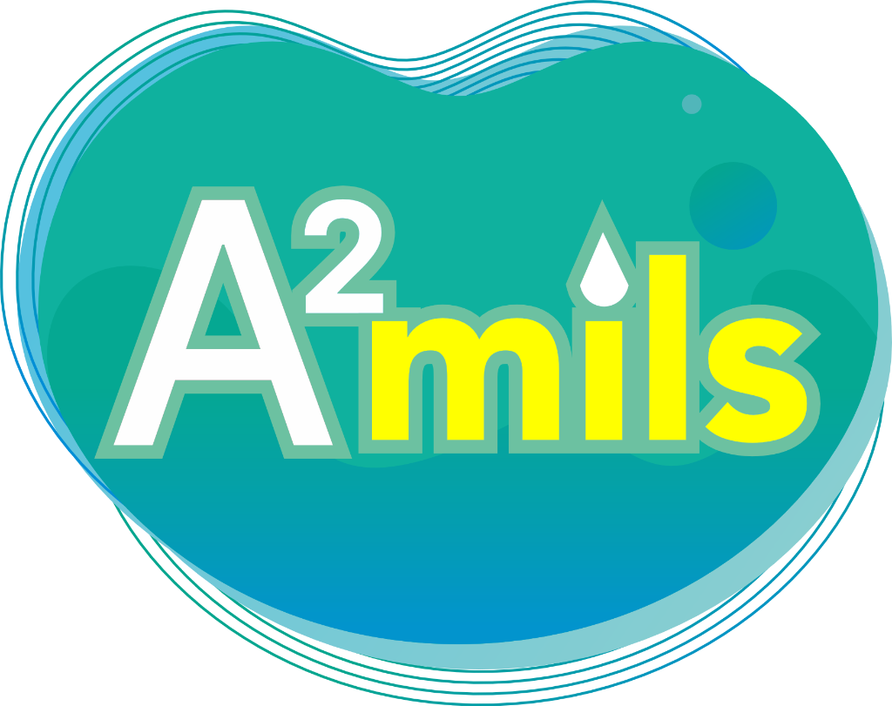

# A²mils (Air Mineral Alami Pegunungan) - Official Company Profile Website



Website profil perusahaan modern, estetik, dan interaktif untuk brand **A²mils** (Air Mineral Alami Dalam Kemasan) yang bersumber dari kaki Gunung Ciremai, Kabupaten Kuningan, Jawa Barat.

---

## 🏢 Informasi Perusahaan & Legalitas
- **Distributor Utama**: PT. Tirta Boga Mega Kreasi, Indramayu (45282), Jawa Barat, Indonesia
- **Wilayah Pengiriman**: Khusus Wilayah Kabupaten Indramayu & Sekitarnya
- **Sumber & Pengolahan**: Kuningan (45554), Jawa Barat, Indonesia
- **Nomor Izin Edar**: **BPOM RI MD 265228006191**
- **Standar Mutu**: **SNI 3553:2015**
- **Sertifikasi Kehalalan**: **Halal Indonesia**
- **Layanan Pelanggan & Sales**: +62 821-1588-6482 (`https://wa.me/6282115886482`)

---

## 📦 Varian Produk
1. **A²mils Gelas 220 ml** (Dus isi 48) - Praktis & higienis untuk hajatan, pengajian, katering, & rapat.
2. **A²mils Botol 330 ml** (Dus isi 24) - Kemasan botol mini elegan untuk hotel, resto, & seminar.
3. **A²mils Botol 600 ml** (Dus isi 24) - Varian terpopuler untuk olahraga, kerja, & hidrasi aktif harian.

---

## 🚀 Fitur Interaktif Website
- 🌊 **Dynamic Canvas Water Physics**: Gelembung air lembut yang merespons pergerakan kursor mouse.
- 🌓 **Dual Theme Support**: Mode Terang (*Light Mode*) & *Ocean Deep Dark Mode*.
- 🧮 **Interactive Hydration Calculator**: Menghitung kebutuhan air harian & rekomendasi takaran botol/gelas.
- 📱 **3D Tilt Product Catalog & Modal**: Pratinjau spesifikasi produk dengan efek 3D.
- 💬 **WhatsApp Order & Partnership Generator**: Simulasi pemesanan & kemitraan yang otomatis membuat pesan WhatsApp terformat.

---

## 🛠️ Instalasi & Menjalankan Lokal

```bash
# Clone repositori
git clone https://github.com/bigboss021/A2mils.git

# Masuk ke folder direktori
cd A2mils

# Install dependencies
npm install

# Jalankan server pengembangan
npm run dev

# Build untuk produksi
npm run build
```

---

&copy; 2026 **A²mils**. All Rights Reserved.
